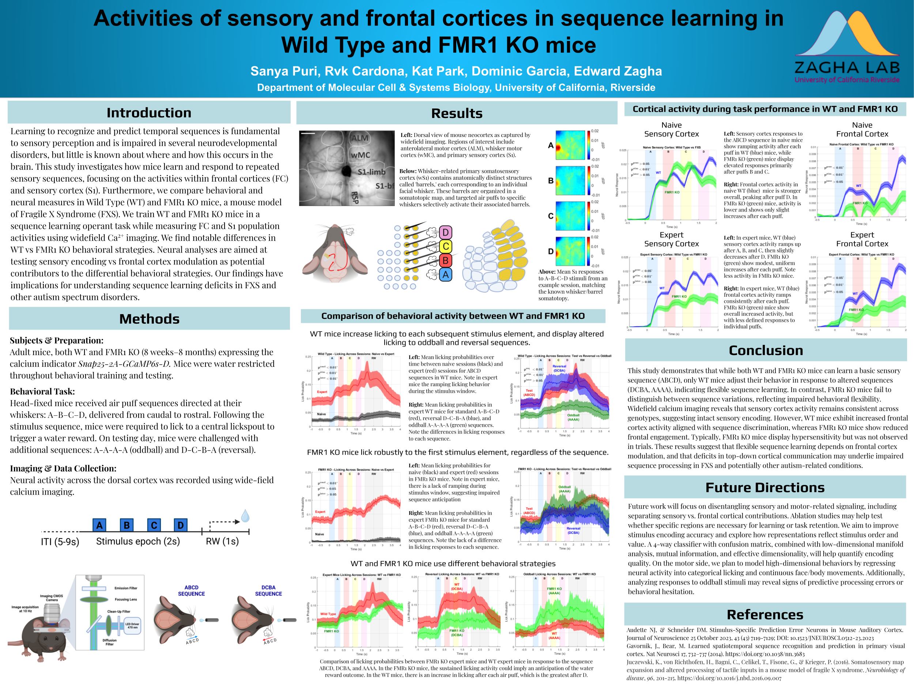

# MCSB-Poster

[Zagha Lab Project Contributions](https://github.com/kwakkle/lab-contributions)

# Activities of sensory and frontal cortices in sequence learning in Wild Type and FMR1 KO mice

This repository contains code used in our study on sequence learning and cortical dynamics in wild-type and FMR1 knockout mice. This research was a collaborative effort by Sanya Puri, Rvk Cardona, Kat Park, and Dominic Garcia, conducted under the guidance of Dr. Edward Zagha. The project was presented at the UC Riverside Department of Molecular, Cell and Systems Biology Research Symposium.

## Overview

We investigated how mice learn to recognize and respond to temporal sensory sequences, focusing on differences between Wild Type (WT) and FMR1 Knockout (KO) mice, a model of Fragile X Syndrome (FXS). Mice were trained to respond to whisker-based sensory sequences in an operant conditioning task. The goal was to identify neural and behavioral markers of sequence learning, and how these differ in the presence of a neurodevelopmental disorder.

We recorded widefield calcium (Ca²⁺) signals from dorsal cortical regions, primarily the primary somatosensory cortex (S1) and frontal cortex (FC), while mice performed the task.

## Poster

A PDF version of the research poster presented at the UC Riverside Department of Molecular, Cell and Systems Biology Research Symposium is available [here](poster/Cardona_FXS_SequenceLearning_Poster.pdf).

## Contributions
I developed and maintained several scripts in MATLAB for the following stages of the research:

**Preprocessing**
- Aligned behavioral events with neural recordings
- Motion-corrected and ΔF/F normalized widefield calcium imaging data
- Applied spatial and temporal filters to reduce noise and extract relevant neural signals

**Behavioral Analysis**
- Extracted licking responses aligned to stimulus onset
- Performed time-binned averaging across trials and mice
- Computed selectivity indices and d-prime (d′) values to quantify discrimination between sequence types

**Statistical Analysis**
- Ran repeated-measures ANOVAs to compare stimulus conditions, genotypes, and timepoints
- Performed PCA (Principal Component Analysis) to reduce dimensionality of cortical activity data

**Data Visualization**
- Created summary plots comparing licking behavior and cortical activity across WT and KO groups
- Overlaid SEM shading, stimulus timing bars, and annotations for figures used in our final poster
- Generated heatmaps and d′ maps to show sequence-specific cortical activation

## Author

RVK “Kenny” Cardona  
M.S. Graduate Student, Biomedical Sciences, UC Riverside  
[rvkcardona.com](http://rvkcardona.com) | [@kwakkle](https://github.com/kwakkle)

