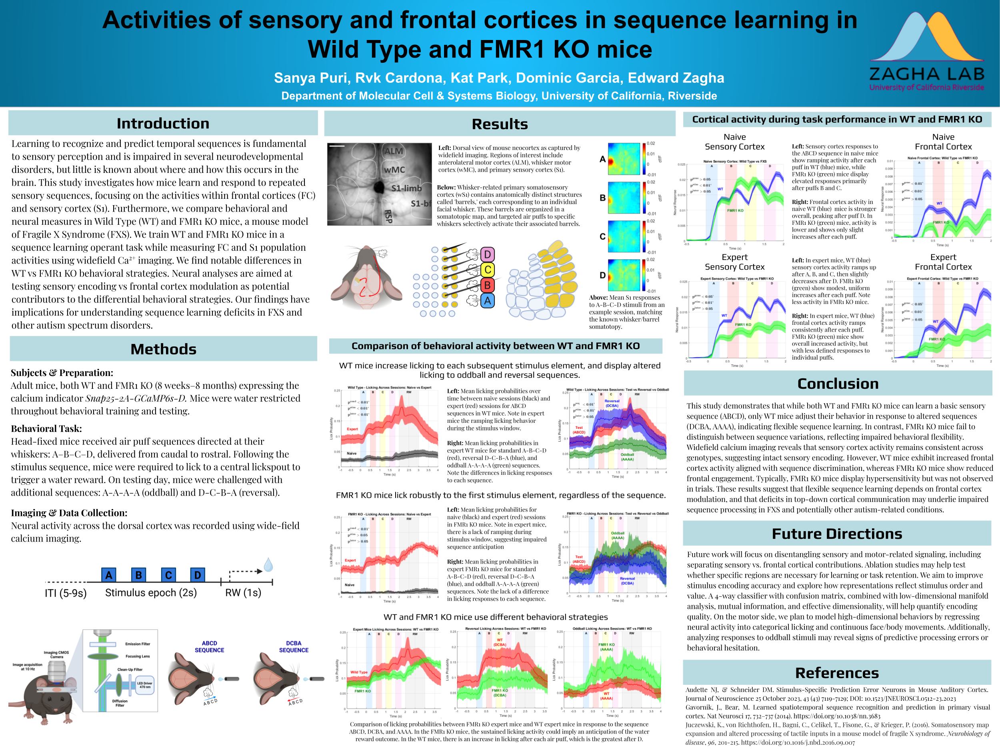

# MCSB-Poster

# Activities of sensory and frontal cortices in sequence learning in Wild Type and FMR1 KO mice

This repository contains code used in our study on sequence learning and cortical dynamics in wild-type and FMR1 knockout mice. This research was a collaborative effort by Sanya Puri, Rvk Cardona, Kat Park, and Dominic Garcia, conducted under the guidance of Dr. Edward Zagha. The project was presented at the UC Riverside Department of Molecular, Cell and Systems Biology Research Symposium.

## Overview

We trained mice on a sequence learning task and recorded widefield Ca²⁺ activity from the sensory and frontal cortices. This code supports data preprocessing, statistical analysis (ANOVA, PCA), and visualization of behavioral and neural activity.

## Poster

A PDF version of the research poster presented at the UC Riverside Department of Molecular, Cell and Systems Biology Research Symposium is available [here](Cardona_FXS_SequenceLearning_Poster.pdf).

## Structure

- `scripts/`: MATLAB scripts for preprocessing, PCA, ANOVA, and visualization.
- `data/`: (Synthetic/example data only — real data not included)
- `figures/`: Sample plots of processed Ca²⁺ signals and behavioral metrics.

## Requirements

- MATLAB R2022a or later
- Statistics and Machine Learning Toolbox
- Signal Processing Toolbox

## Author

RVK “Kenny” Cardona  
M.S. Graduate Student, Biomedical Sciences, UC Riverside  
[rvkcardona.com](http://rvkcardona.com) | [@kwakkle](https://github.com/kwakkle)

